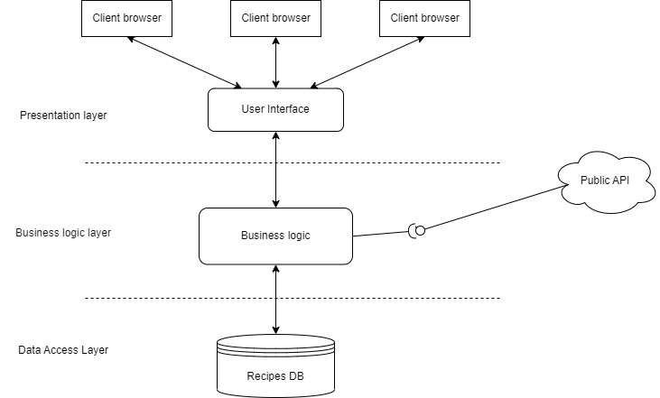
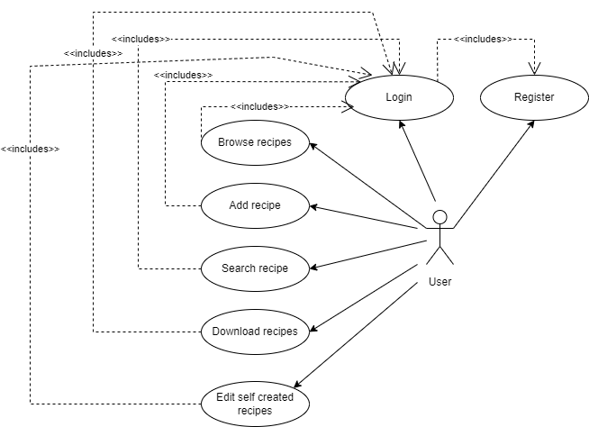

# Recept gyűjtemény

## Feladatkiírás

A hallgatók feladata egy olyan webes vagy mobil alkalmazás elkészítése, amely receptek keresését teszi lehetővé nagy recept katalógusból, több szempont szerint. Az alkalmazás adatbázisa lehet saját scrape-elt adatra épülő, vagy használhatnak létező recept API-kat is.

## A fejlesztői csapat
| Név      |     NEPTUN-kód        |  E-mail cím |
|----------|:---------------------:|-------------|
| Sándor József |  HE0HPP | sjozsef2000@gmail.com   |
| Szász Tamás   |  PCKVJ5 | tamas.szasz12@gmail.com |

## Részletes feladatleírás
A projekt során célunk egy olyan alkalmazás készítése, amely képes egy publikus API végpontról recepteket összegyűjteni. Az összegyűjtött recepteket egy adatbázisban eltárolja. Az eltárolt recepteket képes a felhasználó számára megjeleníteni egy webes felületen. A felületen a felhasználónek lehetősége van a receptek kezelésére, keresésére, illetve új receptek hozzáadására. Az alkalmazás elérése regisztrációhoz kötött így a felhasználónak lehetősége van regisztrálni, illetve bejelentkezni az alkalmazásba.

## Technikai paraméterek
A definiált alkalmazást .NET Core 3.1 platformra készítjük el annak érdekében, hogy több operációs rendszeren (Windows, Linux) is lehessen futtatni. Az alkalmazás adatait egy SQL Server (vagy más hasonló) adatbázisban tárolja annak érdekében, hogy a publikus API által visszaadott adatokat megőrizze és ne kelljen minden adatlekérő felhasználói interakció után a távoli végponthoz forduljon az alkalmazás. Az adatok adatbázisban való tárolása továbbá biztosítja azt is, hogy ha a használt végpont nem üzemel, az alkalmazás akkor is funkcionális lesz. Az alkalmazás működéséhez továbbá szükség van egy webszerverre (a megvalósításban IIS/IIS express).

## Architektúra
Az alkalmazás megvalósításához három rétegű architektúrát fogunk használni. Az adatelérési réteghez tartozó adatbázisban fogjuk tárolni az alkalmazás altal felhasznált receptek adatait. Az üzleti logikai réteg felel a távoli végpont által publikált recept adatok lekérdezéséért, a felhasználó kezelésért, illetve a receptek kezeléséért. A megjelenítési réteg felel a tárolt receptek megjelenítéséért és fogadja a felhasználók interakcióit.

## Use case-ek:

### Use case diagram:

### Adminisztráció:

- Felhasználó regisztráció (username/password)

- Felhasználó bejelentkezés

### Receptkezelés:

- Saját recept létrehozás és elmentés az adatbázisba

- Saját recept módósítása (másik felhasználó receptjét nem lehet módosítani)

- Adatbázisban levő receptek szűrése/keresése a recept metaadatai alapján

- Tetszőleges recept letöltése .txt formátumban
