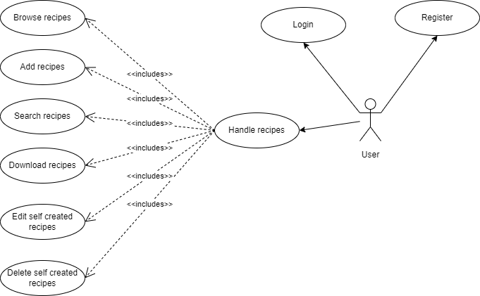

# Követelményspecifikáció - Receptgyűjtemény

## Feladatkiírás

A hallgatók feladata egy olyan webes vagy mobil alkalmazás elkészítése, amely receptek keresését teszi lehetővé nagy recept katalógusból, több szempont szerint. Az alkalmazás adatbázisa lehet saját scrape-elt adatra épülő, vagy használhatnak létező recept API-kat is.

## A fejlesztői csapat
| Név      |     NEPTUN-kód        |  E-mail cím |
|----------|:---------------------:|-------------|
| Sándor József |  HE0HPP | sjozsef2000@gmail.com   |
| Szász Tamás   |  PCKVJ5 | tamas.szasz12@gmail.com |

## Részletes feladatleírás
A projekt során célunk egy olyan alkalmazás készítése, amely képes egy publikus API végpontról recepteket összegyűjteni. Az összegyűjtött recepteket egy adatbázisban eltárolja. Az eltárolt recepteket képes a felhasználó számára megjeleníteni egy webes felületen. A felületen a felhasználónek lehetősége van a receptek kezelésére, keresésére, illetve új receptek hozzáadására. Az alkalmazás elérése regisztrációhoz kötött így a felhasználónak lehetősége van regisztrálni, illetve bejelentkezni az alkalmazásba.

## Technikai paraméterek

A definiált alkalmazást .NET Core 3.1 platformra készítjük el annak érdekében, hogy több operációs rendszeren (Windows, Linux) is lehessen futtatni. Az alkalmazás adatait egy SQL Server (vagy más hasonló) adatbázisban tárolja annak érdekében, hogy a publikus API által visszaadott adatokat megőrizze és ne kelljen minden adatlekérő felhasználói interakció után a távoli végponthoz forduljon az alkalmazás. Az adatok adatbázisban való tárolása továbbá biztosítja azt is, hogy ha a használt végpont nem üzemel, az alkalmazás akkor is funkcionális lesz. Az alkalmazás működéséhez továbbá szükség van egy webszerverre (a megvalósításban IIS/IIS express).

## Architektúra

Az alkalmazás megvalósításához három rétegű architektúrát fogunk használni. Az adatelérési réteghez tartozó adatbázisban fogjuk tárolni az alkalmazás altal felhasznált receptek adatait. Az üzleti logikai réteg felel a távoli végpont által publikált recept adatok lekérdezéséért, a felhasználó kezelésért, illetve a receptek kezeléséért. A megjelenítési réteg felel a tárolt receptek megjelenítéséért és fogadja a felhasználók interakcióit.

## Use case-ek:

### Use case diagram:
 
  
 
  
 

### Adminisztráció:

- Felhasználó regisztráció (username/password): A felhasználó létre kell hozzon egy fiókot, annak érdekében, hogy később be tudjon jelentkezni a rendszebe.

- Felhasználó bejelentkezés: A felhasználó be kell jelentkezzen a rendszerbe mielőtt, böngészni tudja a recepteket, illtve, új recepteket tud hozzáadni a már meglevők mellé, a saját receptjeit módosítani és törölni tudja.

### Receptkezelés:

- Recept létrehozás és elmentés az adatbázisba: A felhasználó a már meglevő publikus API-ról betöltött, illetve más felhasználók által készített receptek mellé, új saját receptet vehet fel. Ezt a receptet is eltárolja az alkalmazás az adatbázisban, illetve a felvétel után más felhasználók számára is látható lesz.

- Recept módósítása: A felhasználó képes az alkalmazásban recepteket módosítani, de csak a saját maga által felvett recepteket módosíthatja, a publikus végpontról gyűjtött receptek, illetve a más felhasználók által létrehozott recepteket nem.

- Recept törlése: A felhasználó képes az alkalmazásban recepteket törölni, de csak a saját maga által felvett recepteket törölheti, a publikus végpontról gyűjtött receptek, illetve a más felhasználók által létrehozott recepteket nem.

- Receptek szűrése/keresése a recept metaadatai alapján: A felhasználónak lehetősége van a felületen különböző recept tulajdonságok alapján szűkíteni a megjelenített recepteket, így a sokkal gyorsabban eljuthat az általa keresett recepthez vagy recepttípushoz.

- Tetszőleges recept letöltése .txt formátumban: A felhasználónak egy recept kiválasztása után lehetősége van a recepthez tartozó metainformációkat/adatokat .txt formában letölteni, annak érdekében, hogy internetkapcsolat nélkül is a letöltött recepteket meg tudja nézni a saját számítógépén.

# Rendszerterv - ReciPerfect

ReciPerfect - Webes receptkezelő alkalmazás fejlesztése a Szoftverarchitektúrák tárgy házi feladatához.

## A rendszer célja, funkciói és környezete

### Feladatkiírás

A hallgatók feladata egy olyan webes vagy mobil alkalmazás elkészítése, amely receptek keresését teszi lehetővé nagy recept katalógusból, több szempont szerint. Az alkalmazás adatbázisa lehet saját scrape-elt adatra épülő, vagy használhatnak létező recept API-kat is.

A feladat részletes specifikációja a követelményspecifikáció fejezetben olvasható.

### A rendszer által biztosítandó tipikus funkciók

Vázlatosan az alábbi funkciók biztosítását várjuk el a rendszertől. (A funkciók részletes
definíciója szintén a követelményspecifikáció dokumentumban olvasható.)

- Adminisztáció
	- Regisztáció
    - Bejelentkezés
- Receptkezelés
	-  Recept létrehozás és elmentés az adatbázisba
    -  Recept módósítása
    -  Recept törlése
    -  Receptek szűrése/keresése a recept metaadatai alapján
    -  Tetszőleges recept letöltése .txt formátumban

### A program környezete

Az alkalmazásunkat .NET Core 3.1 platformon készítettük el annak érdekében, hogy több operációs rendszeren (Windows, Linux) is futtatható legyen. Az alkalmazás adatait egy SQL Server adatbázis tárolja, ezzel lehetővé téve azt, hogy a publikus API által visszaadott adatok perzisztensen tárolódjanak és ne kelljen minden adatlekérő felhasználói interakció során a távoli végponthoz forduljon az alkalmazás. Az adatok adatbázisban való tárolása továbbá biztosítja azt is, hogy ha a használt végpont valamilyen okból kifolyólag nem elérhető, az alkalmazás akkor is üzemképes marad. Az alkalmazás a működéséhez IIS express webszervert használ.

## Megvalósítás

Az alkalmazást a feladatkiírásnak megfelelően egy többrétegű alkalmazásként készítettük el. A ReciPerfect ASP.NET Core keretrendszerre épül, így követve annak irányelveit, működési mechanizmusát.

A megvalósított receptkezelő alkalmazásunkat ReciPerfect névre kereszteltük, amely a Recipe és Perfect szavak trükkös összetételéből származik. A név kiválóan jellemzi a szoftverünket, hiszen az recepteket kezel, illetve a fejlesztés alatt mindig törekedtünk a tökéletességre.

A fejezetben áttekintést adunk a program architektúrájáról, bemutatjuk az egyes komponensek feladatait és felelősségeit, továbbá részletesen ismertetjük a használt adatmodellt és a grafikus felhasználói felület felépítését.

### Architektúra

Az alkalmazásunk, a már klasszikusnak tekinthető, N-rétegű architektúrát használ, a ReciPrefect 3 réteget definiál:

- adatelérési réteg (Data Access Layer, DAL)
- üzleti logika rétege (Business Logic Layer, BLL)
- felhasználói felület (Graphical User Interface, GUI)

A 3 felsorolt rétegen kívül, a felhasználókezeléshez egy teljesen elkülönülő beépített ASP.NET Core Identity modult használunk. Mivel ezt a modult készen kaptuk a keretrendszerrel, a belső működését jelen dokumentum keretei között nem tárgyaljuk.

A fejezet további részében a felsorolt 3 réteg feladatkörét, határait és működését fogjuk ismertetni.

#### Adathozzáférési réteg (Data Access Layer)
**Célja:** Az adatbázis és üzleti logika közötti közvetítés.

Az alkalmazásunk adatbázisát egy MSSQL adatbázis képezi. Az adatbázis Entity Framework Core (EF Core) Code First megközelítéssel készült. Az adatbázis séma az EF Core konvenciók alapján generálódik a megadott adatmodell osztályaink alapján. Az adatbázis felépítése az Adat- és adatbázisterv fejezetben van kifejtve részletesen.

Az adathozzáférési rétegben van megvalósítva minden olyan művelet, amely az adatbázishoz fordulást tartalmaz. A DAL funkciókat egy RecipesRepository osztály valósítja meg. Ez az osztály egy jól meghatározott interfészt kínál az üzleti logikai réteg számára.

A szükséges műveletek, mint például az adatbázisban lévő receptek lekérdezése, LINQ lekérdezések formájában vannak megvalósítva. Ez az implementáció egy további védelmi vonalat képez az adatbáziselérésben a rosszindulatú felhasználók ellen, így akadályozva olyan típusú támadásokat, mint az SQL Injection.

#### Üzleti logikai réteg (Business Logic Layer)
**Célja:** Az adatelérési réteg által szolgáltatott adatokat a UI által kezelhető formátumra alakítja.

A következő ábrán a ReciPerfect automatikusan generált osztálydiagramja látható:

Az üzleti logikai réteg 3 fő szereplője a HomeController, a FoodAPIService és a DataCollectorService osztályok. 

A HomeController fogadja a UI interakcióit és elvégzi az aktuális műveletet. A HomeController metódusai egyértelműen megfeleltethetőek a specifikációban leírt Use Case funkcióknak: Létre lehet hozni egy receptet (Create); Lehet törölni a receptet (Delete); Le lehet tölteni a receptet (Download); Lehet módosítani a receptet (Edit); Lehet a recepteket böngészni (Index); A receptekre rá lehet keresni (Search).

A FoodAPIService intézi a receptes API végpont hívását. A hívás eredményét átadja a RecipeRepository adatelérési osztálynak, amely majd perzisztálja az új beérkezett recepteket. Az implementációnkban mi a Spoonacular API-t használtuk fel.

A DataCollectorService lényegében egy háttérben futó szolgáltatást valósít meg, amelynek a feladata, hogy óránként meghívja a FoodAPIService szolgáltatást.

A FoodAPIService és a DataCollectorService Dependency Injection segítségével vannak konfigurálva, így téve rugalmassá és lazán csatoltá az alkalmazásunkat.

#### Grafikus felhasználói felület (Graphical User Interface)

**Célja:** A felhasználók számára egyszerű, könnyen átlátható felületet nyújtani, az összes
funkciót elérhetővé tenni.

Az oldalak egységes kinézetét az ASP.NET layout oldalak segítségével biztosítja. Az oldalak megjelenítésének testreszabására a Bootstrap könyvtárat használtuk.

A ReciPerfect felhasználói felülete leginkább a modern webshopok jellegzetességeit hordozza. A weboldal betöltődése után egy jól megszokott Register/Login felület fogad. Bejelentkezést követően egy receptekből álló album jelenik meg:

Ebben a fejezetben érdemes megjegyezni, hogy jogosultság szerint két recepttípust különböztetünk meg: saját és nem saját. A saját receptet az adott felhasználó hozza létre, míg a nem saját receptet vagy az API végponttól származik vagy egy másik felhasználó hozta létre. A saját receptünket tudjuk módosítani, illetve szükség esetén törölni, míg a nem

Az oldalak közti bonyolult navigáció okozta kellemetlenség elkerülése érdekében a ReciPerfect modális ablakokat használ a különböző tartalmak megjelenítésére. Így, az album elemeire kattintva egy modális ablak ugrik fel, amelyen részletesebb leírást kapunk az adott receptről.
 Az albumot alkotó kártyákon több elem található: egy színes kép az adott recept lehetséges eredményéről, a recept neve, egy rövid leírás, Edit és Delete gomb, a szükséges elkészítési idő, végül a recept forrása zárja a sort. Az Edit gomb megnyomásával egy modális ablak jelenik meg, amelyen lehetőségünk van szerkeszteni az adott receptet. A Delete gomb megnyomása után pedig egy olyan modális ablak tűnik fel, amely egy megerősítést kér tőlünk a törlést illetően.

Az oldal bal oldalán találhatóak a receptek keresésést illetve szűrését szolgáló elemek. Itt lehetőségünk van rákeresni a receptre a neve alapján, vagy kiszűrhetjük a vegetariánus, vegán, gluténmentes és laktózmentes recepteket.

Az előbbieken kívül amire még igazán büszkék vagyunk, ami a felhasználói felületet illeti, az a széleskörű input validáció és a hozzávalók kiválasztására szolgáló lenyíló lista:

{ width=60% }

   
### Adat- és adatbázisterv

Az adatbázis sémáját az API tanulmányozása után készítettük el, mivel az API által visszaadott entitásokat szerettük volna eltárolni adatbázisban. A kapott adatokat tanulmányozva számos több-több kapcsolatot fedeztünk fel, ennek megfelelően az egyen entitásokhoz rendelhető sémák mellett létrehoztuk a megfelelő kapcsolótáblákat (pl. Recipe - AnalyzedInstruction, Step - Ingredient stb.). A kapcsolótáblákban behivatkoztuk a megfelelő idegen kulcsokat a két összekapcsolni kívánt tábla elsődleges kulcsaira, illetve a duplikációk elkerülése végett a kapcsoló táblákban az egyes rekordokban levő két mező együttesen elsődleges kulcs is. Ebben az esetben nem volt szükséges surrogate key-t használni elsődleges kulcsként, mivel a két oszlop együttese meghatározza egyedileg az adott rekordot. 

## Telepítési leírás

A program futtatásához szükségünk van egy telepített és futó Micorsoft SQL Server 2019 vagy Microsoft SQL Server Express 2019 adatbáziskezelőre, amelyben beállítjuk, hogy az adatbázis kezdeti katalógusa "mssqllocaldb" legyen. Az adatbáziskezelő mellett szükséges telepíteni az ASP.NET Core Runtime 3.1.31 Hosting Bundle-t az alkalmazás futtatásához. A telepítések után csomagoljuk ki a beadott binárist tartalmazó zip-et és indítsuk el a Recipes.exe fájlt. Első indításkor a program megpróbál csatlakozni a megjelölt adatbázis katalógushoz és létrehozza benne a Recipes adatbázist a program működéséhez szükséges táblákkal, az elkészített migrációk alapján. Ha a program sikeresen elindult akkor egy Microsoft Edge böngészőben a http://localhost:5000 címet beírva (amely automatikusan átirányít a https://localhost:5001 címre annak érdekében hogy csak https felett lehessen az alkalmazást használni) láthatjuk az alkalmazás kezdő képernyőjét.

## A program készítése során felhasznált eszközök

- Github - https://github.com/
- Visual Studio 2019 - https://learn.microsoft.com/en-us/visualstudio/releases/2019/release-notes
- SQL Server Management Studio (SSMS) 19 - https://learn.microsoft.com/en-us/sql/ssms/download-sql-server-management-studio-ssms-19?view=sql-server-ver16
- Microsoft Edge
- RestSharp - https://www.nuget.org/packages/RestSharp
- Newtonsoft Json - https://www.nuget.org/packages/Newtonsoft.Json

## Összefoglalás

Munkánk során megterveztük, implementáltuk illetve dokumentáltuk a ReciPerfect
nevű receptkezelő rendszert. Az elkészített alkalmazás segítségével saját illetve más forrásból származó étel recepteket kezelhetünk.

A megvalósított alkalmazás 3 rétegű architektúrát használ: adatbázis réteg, üzleti logikai
réteg és felhasználói felület. Az alkalmazás ASP.NET Core platformon készült. A receptek perzisztens tárolásáért egy helyi MSSQL adatbázis felelős. A felhasználói felület ASP.NET layout oldalakból áll, amelyek a Bootstrap alkalmazásával igényes megjelenést biztosítanak a ReciPerfect alkalmazásunknak.

Munkánk során részletes terveket készítettünk – részük jelen dokumentum tartalmát
képezik – és jelentős mennyiségű implementációs munkát is végeztünk. Ennek eredményeképpen egy jól működő és megbízható alkalmazást készítettünk el, amely az elvárt
alapvető felhasználói igényeknek megfelel, feladatát képes ellátni.

## Továbbfejlesztési lehetőségek

A ReciPerfect alkalmazásunkat alapvetően rugalmasra és könnyen bővíthetőre terveztük, így különösebb refactorálás szükségessége nélkül egészíthető ki újabb funkciókkal. Ilyen továbbfejlesztési lehetőség, illetve hasznos funkció lehet:

- saját kép feltöltése a saját recepthez
- szűrési lehetőség a saját receptekre
- további recept metaadatok megjelenítése a felhasználói felületen.
- szűrési feltételek további metaadatokra

## Hivatkozások

- ASP.NET Core - https://dotnet.microsoft.com/en-us/learn/aspnet/what-is-aspnet-core
- Bootstrap - https://getbootstrap.com/
- Microsoft SQL Server - https://en.wikipedia.org/wiki/Microsoft_SQL_Server
- Microsoft Entity Framework Core - https://learn.microsoft.com/en-us/ef/core/
- RestSharp - https://www.nuget.org/packages/RestSharp
- Newtonsoft Json - https://www.nuget.org/packages/Newtonsoft.Json
- Microsoft.jQuery.Unobtrusive.Ajax - https://www.nuget.org/packages/Microsoft.jQuery.Unobtrusive.Ajax
- Spoonacular API - https://spoonacular.com/food-api

